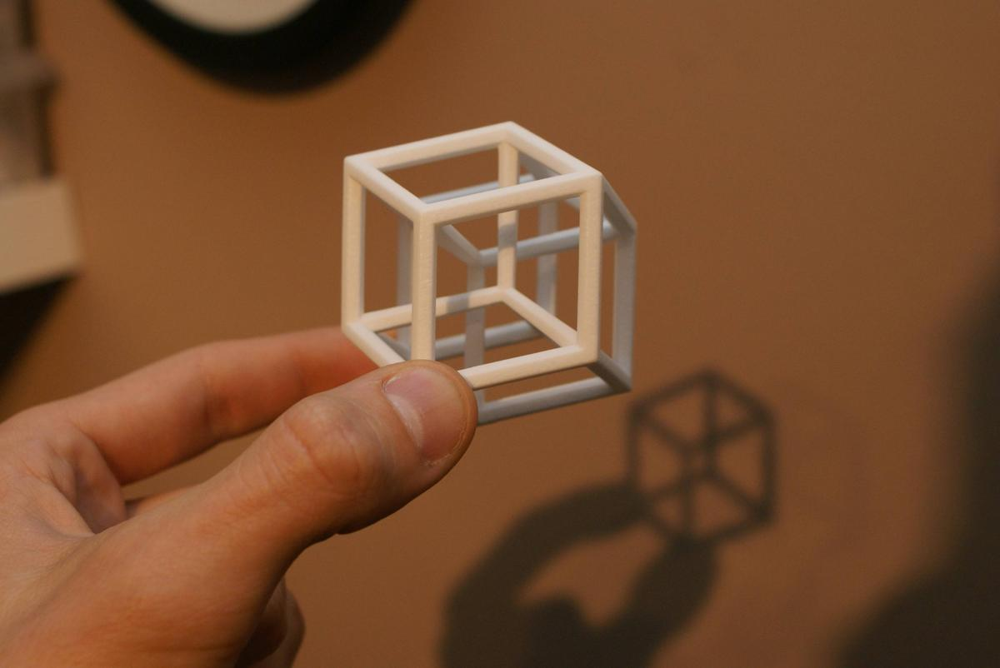

# Collection of being Young

## Thoughts

1.Natural does not fail me on the any corner of the world, but sometimes humanity does. So do I.
2.Desire is the direction, planning is the magnitude. it's the vector for victory.
3.It's stopping me being great, not my abilities, but my greeds.
---
$\pi$

## Poem

## Hypothesis

    1.Maybe God is a super high dimensional substance. Indeed he created us as himself,
    but in a 3D space, just like what happens for a 4D hyper cube, project in 3D space.
